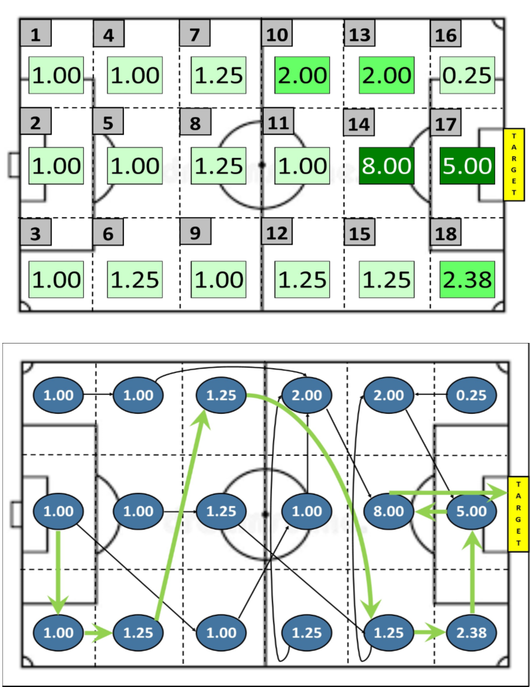
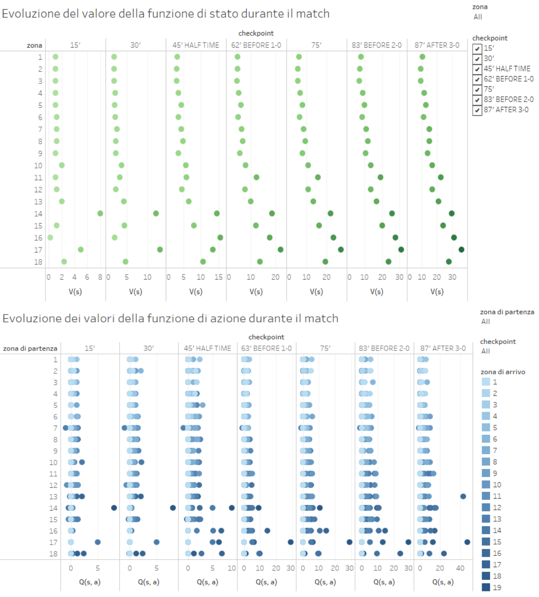

La prima fase consiste nell'importare i dataset utili per lo scopo di questo progetto e nell'effettuare il pre-processing con lo scopo di ottenere un unico data frame per le successive elaborazioni.

```{r}
build_action_data <- function(df_data, action_weights) {
  for (i in 1:nrow(action_weights)) {
    for (j in 2:ncol(action_weights)) {
      df_data[, ncol(df_data)+1] <- action_weights[i, j]
      colnames(df_data)[ncol(df_data)] <- paste(colnames(action_weights)[j], action_weights[i,1], sep="_") 
    }
  }
  return(df_data)
}

df_data <- read.csv(paste0(gsub("Script", "Dataset", getwd()), "/spain-sweden.csv"))
action_weights <- read.csv(paste0(gsub("Script", "Dataset", getwd()), "/actions_weight.csv"))
checkpoints <- read.csv(paste0(gsub("Script", "Dataset", getwd()), "/checkpoint.csv"))
data <- build_action_data(df_data, action_weights)
cat("spain-sweden.csv", nrow(df_data), ncol(df_data), "\n")
cat("actions_weight.csv", nrow(action_weights), ncol(action_weights), "\n")
cat("checkpoint.csv", nrow(checkpoints), ncol(checkpoints), "\n")
cat("dataset finale", nrow(data), ncol(data))
```

La seconda fase consiste nel verificare la correttezza dei dati all'interno del dataset, il quale deve soddisfare i seguenti vincoli relativi al tagging delle azioni elementari del match effettuato con un opportuno software di video-analysis:

1. ad ogni azione deve essere associata una sola zona di partenza

2. ad ogni azione deve essere associata una sola zona di arrivo

3. ad ogni azione deve essere associata una sola modalità con la quale è stata eseguita

4. ad ogni azione deve essere associato un solo outcome (positivo o negativo)

```{r}
check_data <- function(data) {
  err <- 0
  col_from <- c()
  col_to <- c()
  col_action <- c()
  col_outcome <- c()
  for (i in 1:18) {
    col_from[i] <- which(colnames(data) == paste0("From", i))
    col_to[i] <- which(colnames(data) == paste0("To", i))
  }
  col_to[19] <- which(colnames(data) == "ToTarget")
  col_action <- (col_to[19]+1):(col_to[19]+nrow(action_weights))
  col_outcome <- (col_action[nrow(action_weights)]+1):(col_action[nrow(action_weights)]+2)
  for (i in 1:nrow(data)) {
    if (sum(data[i, col_from]) != 1) { return(c("From", i)) }
    if (sum(data[i, col_to]) != 1) { return(c("To", i)) }
    if (sum(data[i, col_action]) != 1) { return(c("Action", i)) }
    if (sum(data[i, col_action]) != 1) { return(c("Outcome", i)) }
  }
  return(err)
}

check_data(data)
```

La terza fase consiste nel definire tutte le funzioni di supporto per poter eseguire sia la fase di "Exploration" sia la fase di "Exploitation" dell'algoritmo di apprendimento per rinforzo.

Di seguito, la definizione della funzione "score" che ha lo scopo di calcolare lo score complessivo delle azioni elementari effettuate dal sistema squadra da una zona di campo (parametro formale "from") ad un'altra (parametro formale "to"), tenendo conto di un periodo di tempo del match (parametro formale "subset").

Oltre allo score complessivo, inteso come somma dei pesi associati a ciascuna azione elementare considerata e definiti a priori, la funzione "score" restituisce lo score medio delle azioni positive/negative e la probabilità del verificarsi di un'azione positiva/negativa, tutti valori riferiti da una specifica zona di campo ad un'altra.

```{r}
score <- function(subset, from, to) {
  sc_pos <- c()
  sc_neg <- c()
  tot_freq_pos <- 0
  tot_freq_neg <- 0
  outcome <- which(colnames(subset) == c("positivo", "negativo"))
  for (i in 1:nrow(action_weights)) {
    col <- which(colnames(subset) == action_weights[i, 1])
    subset.positive_action <- subset[subset[, col] == 1 & subset[, outcome[1]] == 1, ]
    subset.negative_action <- subset[subset[, col] == 1 & subset[, outcome[2]] == 1, ]
    if (nrow(subset.positive_action) != 0) {
      for (action in 1:nrow(subset.positive_action)) {
          tot_freq_pos <- tot_freq_pos + 1
          sc_pos[tot_freq_pos] <- subset.positive_action[action, (col-i+1)+nrow(action_weights)+length(outcome)+(i-1)*length(outcome)]
      }
    }
    if (nrow(subset.negative_action) != 0) {
      for (action in 1:nrow(subset.negative_action)) {
          tot_freq_neg <- tot_freq_neg + 1
          sc_neg[tot_freq_neg] <- subset.negative_action[action, (col-i+1)+nrow(action_weights)+length(outcome)+(i-1)*length(outcome)+1]
      }
    }
  }
  return(list(from = from,
              to = to,
              score = sum(sc_pos, sc_neg), 
              avg_pos = ifelse(length(sc_pos)>0, round(mean(sc_pos), 2), 0),
              prob_pos = ifelse(length(sc_pos)>0, round(length(sc_pos)/(length(sc_pos)+length(sc_neg)), 2), 0),
              avg_neg = ifelse(length(sc_neg)>0, round(mean(sc_neg), 2), 0),
              prob_neg = ifelse(length(sc_neg)>0, round(length(sc_neg)/(length(sc_pos)+length(sc_neg)), 2), 0)))
}
```

Di seguito, la definizione della funzione "create_score_list" che ha lo scopo di restituire un oggetto lista composto da 342 elementi, uno per ogni combinazione possibile della coppia zona di partenza (18) - zona di arrivo (19 = 18 + target). 

Ogni elemento memorizza al suo interno i parametri restituiti dalla funzione "score" per uno specifico periodo del match. 

L'indice per accedere ad un determinato elemento, sapendo la zona di partenza (from) e la zona di arrivo (to) si ottiene con l'espressione: (from-1)*19 + to 

```{r}
create_score_list <- function(data) {
  score_list <- list()
  k <- 0
  for (i in 1:18) {
    for (j in 1:18) {
      k <- k + 1
      from <- which(colnames(data) == paste0("From", i))
      to <- which(colnames(data) == paste0("To", j))
      subset <- data[data[, from] == 1 & data[, to] == 1, ]
      score_list[[k]] <- score(subset, i, j)
    }
    j <- "Target"
    k <- k + 1
    to <- which(colnames(data) == "ToTarget")
    subset <- data[data[, from] == 1 & data[, to] == 1, ]
    score_list[[k]] <- score(subset, i, j)
  }
  return(score_list)
}
```

Di seguito, la definizione della funzione "expected_reward" che ha lo scopo di calcolare e restituire il valore atteso del reward che ottiene il sistema squadra quando effettua l'azione di transitare da una zona (parametro formale "from") ad un'altra (parametro formale "to").

Affinchè il calcolo possa essere eseguito è necessario fornire la lista degli score ottenibile tramite la funzione "create_score_list" precedentemente descritta.

L'expected reward, infatti, è calcolato con la seguente formula:

EV = score_medio_azioni_positive * prob_azione_positiva + score_medio_azioni_negative * prob_azione_negativa, tutti parametri riferiti ad una specifica coppia zona di partenza - zona di arrivo.

```{r}
expected_reward <- function(score_list, from, to) {
  num_transition <- (from-1)*19 + to
  EV <- score_list[[num_transition]]$avg_pos * score_list[[num_transition]]$prob_pos + score_list[[num_transition]]$avg_neg * score_list[[num_transition]]$prob_neg
  return(EV)
}
```

Di seguito, la definizione della funzione "prob_transition" che ha lo scopo di calcolare e restitutire la probabilità del verificarsi di una specifica transizione dinamica da una zona di campo (parametro formale "from") ad un'altra (parametro formale "to"), prendendo in considerazione uno specifico periodo del match.

Essa viene calcolata con la seguente formula:

p (from -> to) = freq (from -> to) / freq (from -> )

```{r}
prob_transition <- function(data, from, to) {
  if (to == 19) {
    to = "Target"
  }
  n <- nrow(data[data[paste0("From", from)] == 1, ])
  m <- nrow(data[data[paste0("From", from)] == 1 & data[paste0("To", to)], ])
  p <- ifelse(n > 0, m/n, 0)
  return(round(p, 2))
}
```

Di seguito, la definizione della funzione "create_partition" che ha lo scopo di creare una partizione del dataset di partenza al fine di ottenere l'insieme delle azioni elementari avvenute in uno specifico periodo del match.

Il paremetro formale "from" indica l'id del checkpoint che segna l'inizio del periodo di tempo del match che si vuole considerare, mentre il parametro formale "to" indica l'id del checkpoint che segna la fine di questo stesso periodo.

```{r}
create_partition <- function(data, from, to) {
  if (from >= to) {
    return(NULL)
  }
  if (from != 0) {
    from <- checkpoints[which(checkpoints$Checkpoint == from), 3]
  }
  to <- checkpoints[which(checkpoints$Checkpoint == to), 3]
  partition <- data[(from+1):to, ]
  return(partition)
}
```

Di seguito, la definizione della funzione "optimal path" che ha lo scopo di costruire il path ottimale, considerata la matrice Q dei valori della funzione di azione, la policy da essa ottenuta per passare da una zona di campo ad un'altra e i relativi valore di transizione. 

Fornendo la zona di campo dalla quale parte il path ottimale (parametro formale "from"), esso viene costruito con un procedimento backward, ovvero si parte dal target e si trovano gli stati possibili nella policy per cui è massimo il valore d'azione verso il target, tramite la funzione "find_possible_states".

Se tale funzione restituisce un vettore nullo, allora la zona di campo di partenza verso il target sarà quella identificata dalla riga che ha il valore piu alto nella colonna 19 della matrice Q, nonostante questo valore non sia quello massimo per questa riga.

Il procedimento continua a ritroso e vieta di considerare uno stato già attraversato dal path fino a quel momento costruito, terminando quando l'ultimo stato di partenza considerato coincide con quello specificato da "from".

```{r}
find_possible_states <- function(check, policy, to_state) {
  possible_states <- c()
  k <- 1
  for (i in 1:18) {
    if (check[i] == FALSE & policy[i] == to_state) {
      possible_states[k] <- i
      k <- k + 1
    }
  }
  return(possible_states)
}

optimal_path <- function(Q, from, policy, value_transition) {
  check <- rep(F, 19)
  path <- c()
  max.Q <- c()
  end <- FALSE
  possible_states <- find_possible_states(check, policy, 19)
  if (length(possible_states) != 0) {
    max.Q[1] <- max(value_transition[possible_states])
    path[1] <- possible_states[which.max(value_transition[possible_states])]
  }
  else {
    max.Q[1] <- max(Q[, 19])
    path[1] <- which(Q[, 19] == max.Q[1])
  }
  check[19] <- TRUE
  check[path[1]] <- TRUE
  i <- 2
  while (end == FALSE) {
    valid <- which(check == FALSE)
    possible_states <- find_possible_states(check, policy, path[i-1])
    if (length(possible_states) != 0) {
      max.Q[i] <- max(value_transition[possible_states])
      path[i] <- possible_states[which.max(value_transition[possible_states])]
    }
    else {
      max.Q[i] <- max(Q[valid, path[i-1]])
      path[i] <- which(Q[, path[i-1]] == max.Q[i])
    }
    if (path[i] == from) { end <- TRUE }
    check[path[i]] <- TRUE
    i <- i + 1
  }
  return(list(path = path, max.Q = max.Q))
}
```

La quarta fase consiste nell'implementazione dell'algoritmo di Value Iteration (Reinforcement Learning), il cui primo step definisce la fase di "Exploration" durante la quale il sistema squadra aggiorna per la prima volta i valori della funzione di stato per ogni zona di campo, inizializzati a zero all'inizio del match (il sistema squadra "studia" l'avversario)

Ciò avviene quando si raggiunge il primo checkpoint (15esimo minuto), successivamente ad ogni step dell'algoritmo viene considerato il successivo checkpoint (fino all'ultimo specificato) e i valori della funzione di stato cambiano, tenendo in considerazione il periodo complessivo tra l'inizio del match (from = 0 -> checkpoint 0) e quel checkpoint (to = i -> checkpoint i).

L'algoritmo fa uso dei valori di "expected reward" e di "probabilità di transizione" per calcolare ad ogni step gli elementi della matrice "Q.next", il cui valore massimo per ogni riga in corrispondenza di un checkpoint, coincide con il valore della funzione di stato per la zona di campo individuata da quella riga.

```{r}
value_iteration <- function(value_state_function, from, to) {
  partition <- create_partition(data, from, to)
  score_list <- create_score_list(partition)
  new_value_state_function <- rep(0, 19)
  Q.next <- matrix(0, nrow=18, ncol=19)
  for (i in 1:18) {
    sum_prob_transitions <- 0
    for (k in 1:19) {
      sum_prob_transitions <- sum_prob_transitions + prob_transition(partition, i, k) * value_state_function[k]
    }
    for (j in 1:19) {
      Q.next[i, j] <- round(expected_reward(score_list, i, j) + gamma * sum_prob_transitions, 2)
    }
  }
  for (i in 1:18) {
    new_value_state_function[i] <- max(Q.next[i, ])
  }
  new_value_state_function[19] <- max(new_value_state_function[-19])
  return(list(value_state_function = new_value_state_function,
              Q.next = Q.next))
}

value_state_function <- list()
Q.next <- list()
value_state_function[[1]] <- rep(0, 19)
Q.next[[1]] <- matrix(0, nrow=18, ncol=19)
gamma <- 1
for (i in 1:nrow(checkpoints)) {
  step_value_iteration <- value_iteration(value_state_function[[i]], from=0, to=i)
  value_state_function[[i+1]] <- step_value_iteration$value_state_function
  Q.next[[i+1]] <- step_value_iteration$Q.next
}
```

Output dei valori della funzione di stato, ottenuti per ogni checkpoint (il primo elemento della lista è riferito ai valori di inizio del match -> V(s) pari a 0 per ogni s)

Il secondo elemento della lista è rifierito ai valori ottenuti alla fine della fase di "Exploration" (checkpoint 1 -> 15esimo minuto: primo aggiornamento V(s)).

Essi rappresenantano "quanto è buono essere nello stato s" per ogni stato e ad ogni checkpoint, ovvero "quanto ha valore avere il possesso della palla in quella zona di campo".

```{r}
value_state_function[[2]][-19]
value_state_function[[3]][-19]
value_state_function[[4]][-19]
value_state_function[[5]][-19]
value_state_function[[6]][-19]
value_state_function[[7]][-19]
value_state_function[[8]][-19]
```

Rappresentazione su campo da gioco dei valori V(s) e Q(s, a) al termine della fase di Exploration



La quinta fase consiste nell'implentazione della fase di "Exploitation" dell'apprendimento per rinforzo, che parte dal 15esimo minuto (checkpoint 1) e termina in corrispondenza del match.

In questa fase viene utilizzato l'algoritmo off-policy Q-Learning, utilizzato nel seguente modo: il sistema squadra inizializza la matrice "Q_learning" di apprendimento ponendola uguale al secondo elemento dell'oggetto lista "Q.next" ricavato dal Value Iteration.

Successivamente, raggiunto ogni checkpoint, il sistema squadra aggiorna la matrice "Q_learning" (apprendimento) aggiornando ogni singolo elemento in base alla formula dell'algoritmo Q-Learning, in cui sia il parametro "alfa", dipendente dalle relative zone di partenza e di arrivo, sia il valore massimo per ogni zona della matrice "Q_learning.next", sono calcolati tenendo in considerazione le azioni elementari che compongono uno specifico periodo di tempo del match compreso tra due checkpoint consecutivi (from = i-1, to = i), diversamente da quanto fatto per il Value Iteration che considera il periodo di tempo del match dal suo inizio al checkpoint considerato (from = 0, to = i). 

```{r}
Q.learning <- function(Q, Q.next, from, to) {
  partition <- create_partition(data, from, to)
  score_list <- create_score_list(partition)
  alfa <- matrix(0, nrow=18, ncol=19)
  for (i in 1:18) {
    for (j in 1:19) {
      alfa[i, j] <- prob_transition(partition, i, j)
      Q[i, j] <- Q[i, j] + alfa[i, j] * (round(expected_reward(score_list, i, j) + gamma * max(Q.next[i, ]) - Q[i, j], 2))
    }
  }
  return(Q)
}

Q_learning.next <- list()
Q_learning <- list()
Q_learning[[1]] <- Q.next[[2]]
gamma <- 1

for (i in 1:(nrow(checkpoints)-1)) {
  Q_learning.next[[i]] <- value_iteration(value_state_function[[i]], from=i, to=i+1)$Q.next
  Q_learning[[i+1]] <- Q.learning(Q_learning[[i]], Q_learning.next[[i]], from=i, to=i+1)
}
```

Output dei valori di transizione per ogni checkpoint, ovvero i valori massimi della matrice "Q_learning" per ogni zona di campo, in riferimento ad ogni checkpoint. 

Essi rappresentano il valore più alto di "quanto è buono essere in un particolare stato ed effettuare un'azione per transitare in un'altro stato" per ogni stato di partenza e ad ogni checkpoint, ovvero indicano "quanto è buono per il sistema squadra effettuare un'azione con lo scopo di spostare la palla da una zona ad un'altra del campo" massimizzato per azione.

```{r}
value_transition <- list()
for (ck in 1:nrow(checkpoints)) {
  value_transition[[ck]] <- rep(0, 18)
  for (i in 1:18) {
    value_transition[[ck]][i] <- max(Q_learning[[ck]][i, ])
  }
}

value_transition[[1]]
value_transition[[2]]
value_transition[[3]]
value_transition[[4]]
value_transition[[5]]
value_transition[[6]]
value_transition[[7]]
```

Output della policy che massimizza il valore della funzione di azione per ogni stato di partenza e ad ogni checkpoint.

Ogni elemento del vettore "policy" riferito ad uno specifico checkpoint indica la zona di campo di arrivo definita dalla policy partendo dalla zona specificata dalla posizione occupata da quell'elemento all'interno del vettore. 

```{r}
policy <- list()
for (ck in 1:nrow(checkpoints)) {
  policy[[ck]] <- rep(0, 18)
  for (i in 1:18) {
    policy[[ck]][i] <- which(Q_learning[[ck]][i, ] == value_transition[[ck]][i])[1]
  }
}

policy[[1]]
policy[[2]]
policy[[3]]
policy[[4]]
policy[[5]]
policy[[6]]
policy[[7]]
```

Output dei path ottimali e relativi valori di transizione che lo compongono per ogni checkpoint aventi come stato di partenza la zona 2 (parametro attuale "from" = 2), ovvero il path ottimale ricavato ad ogni checkpoint ipotizzando la situazione di portiere in possesso della palla.

```{r}
optimal_path(Q_learning[[1]], from=2, policy[[1]], value_transition[[1]])
optimal_path(Q_learning[[2]], from=2, policy[[2]], value_transition[[2]])
optimal_path(Q_learning[[3]], from=2, policy[[3]], value_transition[[3]])
optimal_path(Q_learning[[4]], from=2, policy[[4]], value_transition[[4]])
optimal_path(Q_learning[[5]], from=2, policy[[5]], value_transition[[5]])
optimal_path(Q_learning[[6]], from=2, policy[[6]], value_transition[[6]])
optimal_path(Q_learning[[7]], from=2, policy[[7]], value_transition[[7]])
```

Visualizzazione evoluzioni V(s) e Q(s, a) durante il match ottenute con Tableau (link dashboard interattive presenti nel Report)



La sesta ed ultima fase consiste nella costruzione di due data frame, uno per memorizzare tutti i valori della funzione di stato V e l'altro tutti i valori della funzione di azione Q, con lo scopo di studiare e analizzare la loro evoluzione durante il match.

Tali data frame sono utilizzati per scrivere i file di input al processo di visualizzazione e analisi effettuato con il software Tableau.

```{r}
build_df_V <- function(value_state_function) {
  state <- c()
  ck <- c()
  k <- 1
  for (i in 1:18) {
    for (j in 1:7) {
      state[k] <- i
      ck[k] <- j
      k <- k + 1
    }
  }
  V <- c()
  k <- 1
  for (i in 1:18) {
    for (j in 2:8) {
      V[k] <- value_state_function[[j]][i]
      k <- k + 1
    }
  }
  return(data.frame(state = state, ck = ck, value_state_function = V))
}

df_VS <- build_df_V(value_state_function)
write.csv(df_VS, paste0(gsub("Script", "Dataset", getwd()), "/output_value_state_function.csv"))
```

```{r}
build_df_Q <- function(Q_learning) {
  state <- c()
  action <- c()
  ck <- c()
  n <- 1
  for (i in 1:18) {
    for (j in 1:19) {
      for (k in 1:7) {
        state[n] <- i
        action[n] <- j
        ck[n] <- k
        n <- n + 1
      }
    }
  }
  Q <- c()
  n <- 1
  for (i in 1:18) {
    for (j in 1:19) {
      for (k in 1:7) {
        Q[n] <- Q_learning[[k]][i, j]
        n <- n + 1 
      }
    }
  }
  return(data.frame(state = state, action = action, ck = ck, value_action_function = Q))
}

df_Q <- build_df_Q(Q_learning)
write.csv(df_Q, paste0(gsub("Script", "Dataset", getwd()), "/output_value_action_function.csv"))
```